<h1 align="center">Snyk GitHub Workshop</h1>

The following workshop is designed to show how Snyk integrates into SCM systems like GitHub and performs various application security scans, what fix/remediation advice is given to secure your applications during different stages of the SDLC, and how you can access them via different interfaces like the web UI, IDE and CLI.

## Prerequisites

* Free GitHub account - https://www.github.com
* Free Snyk account  - https://app.snyk.io 
* [Visual Studio Code](https://code.visualstudio.com/download) connected to your GitHub account, and with the [Snyk Extension installed](https://github.com/snyk/vscode-extension?tab=readme-ov-file#install-the-extension)

## Agenda

We will cover the following topics, some live during today's session, and we'll let you explore the others on your own after the session.

  
Live - Hands-On Session

  
- [ ] Setting up the SCM integration between GitHub and Snyk
- [ ] Importing a repo into Snyk and scanning in via the SCM integration
- [ ] Opening a PR to fix a Snyk Open Source vulnerability
- [ ] (TBD) Running Snyk in Codespaces to check out the IDE experience 
    

  
Live - Demo

  
- [ ] Detecting and suggesting fixes for transitive dependencies via the IDE
- [ ] [_Enterprise-only_] Fix Code issues in the IDE using DeepCode AI Fix
- [ ] Prioritization using Risk scores
- [ ] [_Enterprise-only_] Using `Reachability` as an additional parameter to determine risk
- [ ] [_Enterprise-only_] Reporting to provide visibility and facilitate collaboration between Security and Dev teams
- [ ] [_Enterprise-only_] Creating an inventory of code-based assets and setting up policies for security coverage
- [ ] [_Enterprise-only_] Run-time based risk factors to provide better risk assessment for prioritization
    

  
Offline

- [ ] Running Snyk in the IDE to detect and fix vulnerabilities  
- [ ] Set up the Snyk CLI
- [ ] Include Snyk scans in your CI/CD pipelines
- [ ] Integrate 3rd party tools like Nightfall AI (TBH), GitLeaks, and TruffleHog using GitHub Actions to detect secrets
    

<h1 align="center">Hands-on Workshop Steps</h1>

_Note: It is assumed you're using a Mac for these steps, but it should also work on Windows or Linux with some minor modifications_

Step 1 - Fork our sample repo into your own GitHub account

#### Sign in to your GitHub account

* Navigate to the following GitHub repo - https://github.com/boosef-snyk/JavaCoffeeShop
* Click on the "**Fork**" button
* Check the "**Owner**" field on the next page to ensure you are forking this repo to your personal GitHub account
* Click done

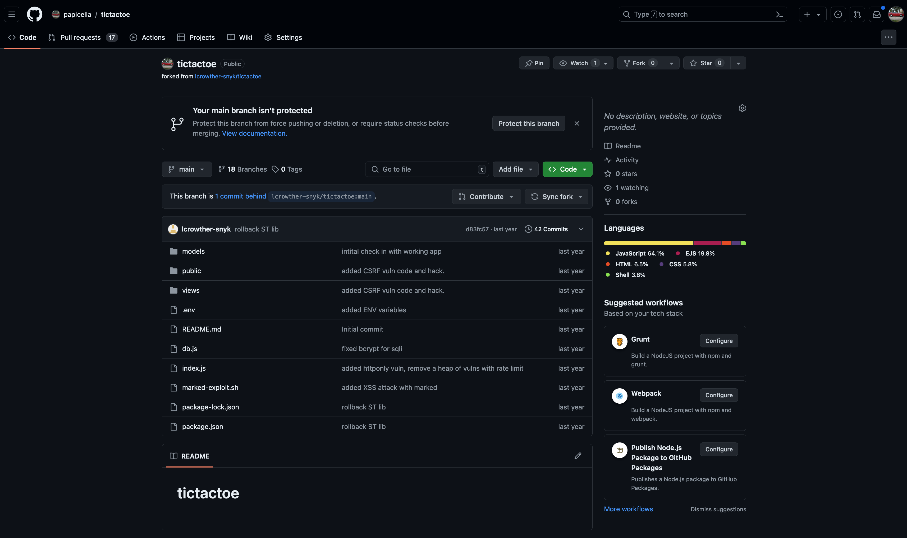

 

Step 2 - Configure GitHub Integration

_NOTE: You may have already setup the GitHub integration on Snyk; in that case, go ahead and skip this step_

#### Login to https://app.snyk.io

* Sign up if you haven't already using your existing Google / GitHub / Bitbucket / Azure AD / Docker account
* Use the guided flow to set up the GitHub integration and grant Snyk access to all your public repos
* In Step 3 of the guided flow, you can select and import only the forked repo into Snyk 

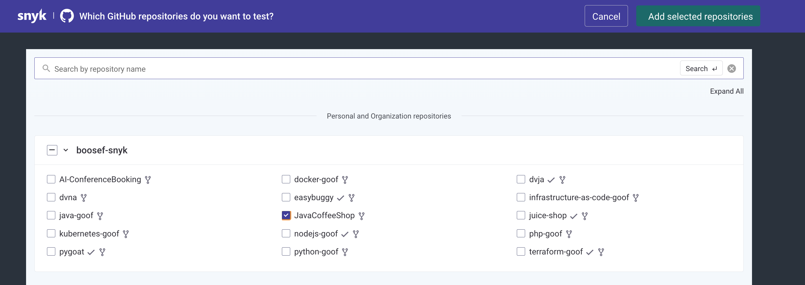

* If you skipped the guided flow, navigate to Integrations -> Source Control -> GitHub

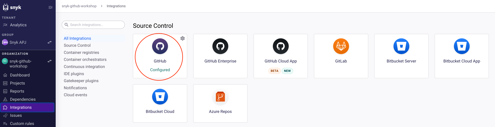

* Fill in your account credentials to connect your GitHub Account (if prompted).
* Now let's enable Code Scanning - you do that as follows:
  * Select Settings -> Snyk Code -> set "Enable Snyk Code" -> Save Changes

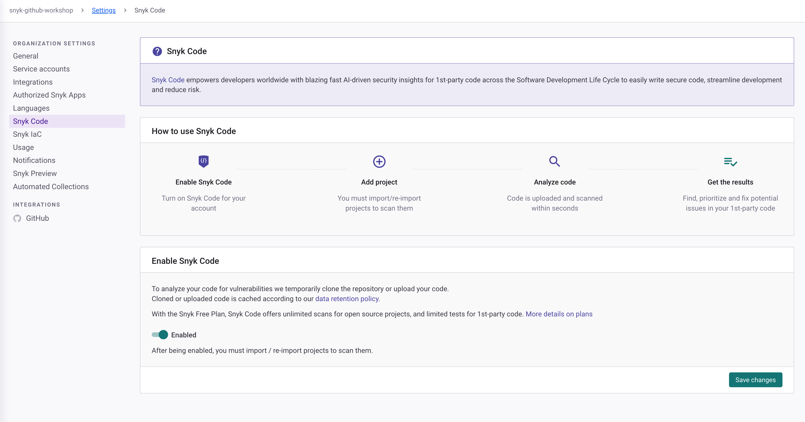

* Similarly, let's enable IaC Scanning - you do that as follows:
  * Select Settings -> Snyk IaC -> Enable "Detect Configuration files" -> Save Changes

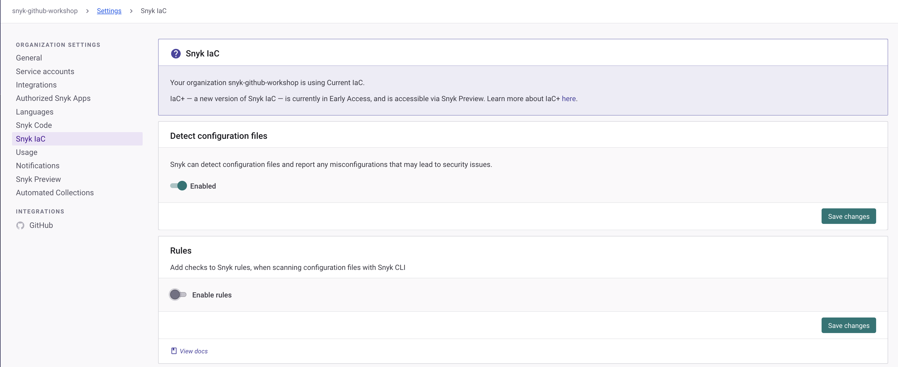

 

Step 2a - Import JavaCoffeeShop Application

#### Optional

_You can skip this if you followed the guided flow in the previous step._

* Now that Snyk is connected to your GitHub Account, import the repo into Snyk as a Project.
* Navigate to Projects menu option
* Click "**Add Project**" then select "**GitHub**"
* Click on the repo you forked
* The import should take about 3 minutes or so

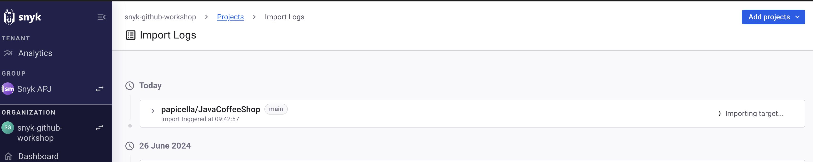

Step 3 - Review SCM Integration Scan Results

* Once the import has completed, when you navigate to your Projects tab (from the sidebar), you should see something like this:

* Let's go ahead and click on pom.xml
* Here you will see all vulnerabilities including a dependency tree of where the vulnerabilities exist, with transitive dependencies also listed 

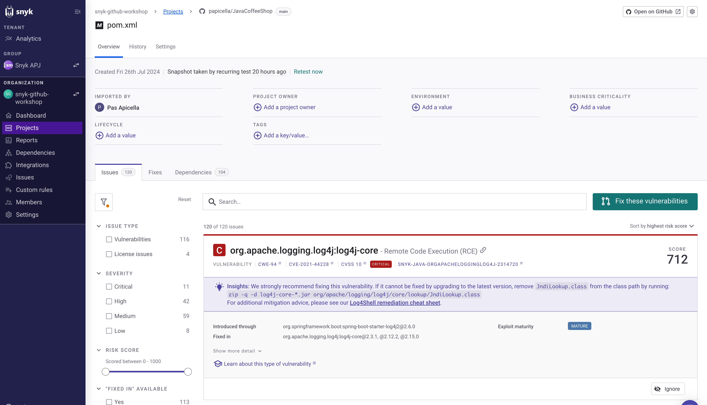

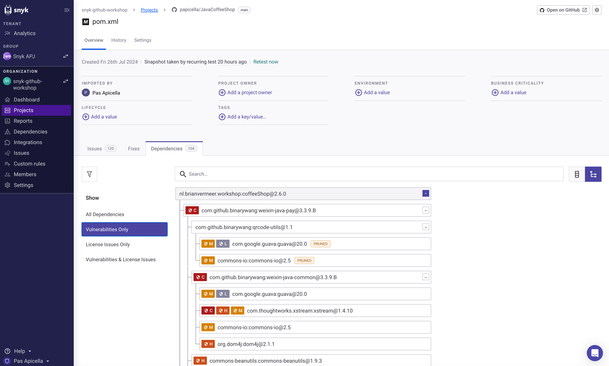

 

Step 4 - Create a Pull Request to trigger a PR check

#### Navigate back to the list of Issues in the pom.xml

* Let's select an issue with a fix available (you should see a green button saying 'Fix this vulnerability')

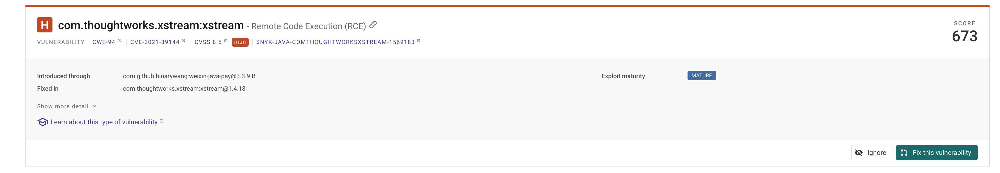
  
* Click on the **Fix this vulnerability** button, and select the option to open a new PR on the next page (you'll need to scroll to the bottom of the page)
* This should take you to a new pull request that has been created in the JavaCoffeeShop repo

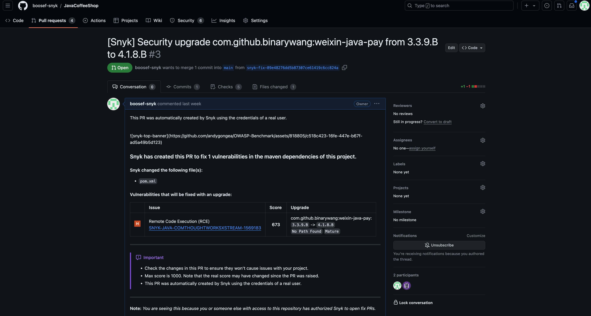

* Scroll to the bottom and you will see the `code/snyk`, `security/snyk`, and `license/snyk` checks running - congratulations, your SCM integration is working as expected!

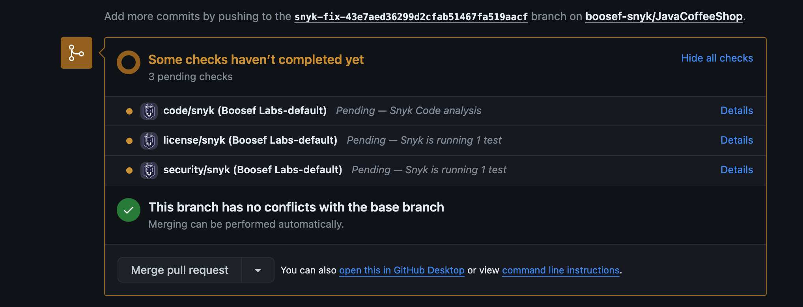

* Once the tests complete running, you can click on the "**Details**" button next to them to view the scan report in the Snyk UI  

Step 5 - Find and fix issues in the IDE
 

#### Switch to the Code section of your repository now 

* We are going to use Codespaces for this section of the workshop. Click on the green '**Code**' button and then '**Create codespace on main**"

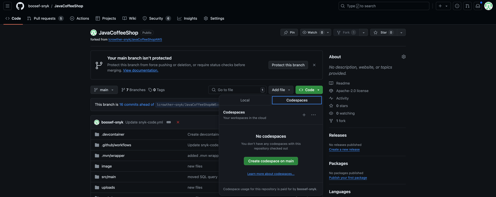

* It will take anywhere between 2-5 minutes for the codespace to spin up and be fully set up. When you see the Snyk logo on the Extensions bar on the left, and status messages popping up on the right side of your screen, it is ready. 

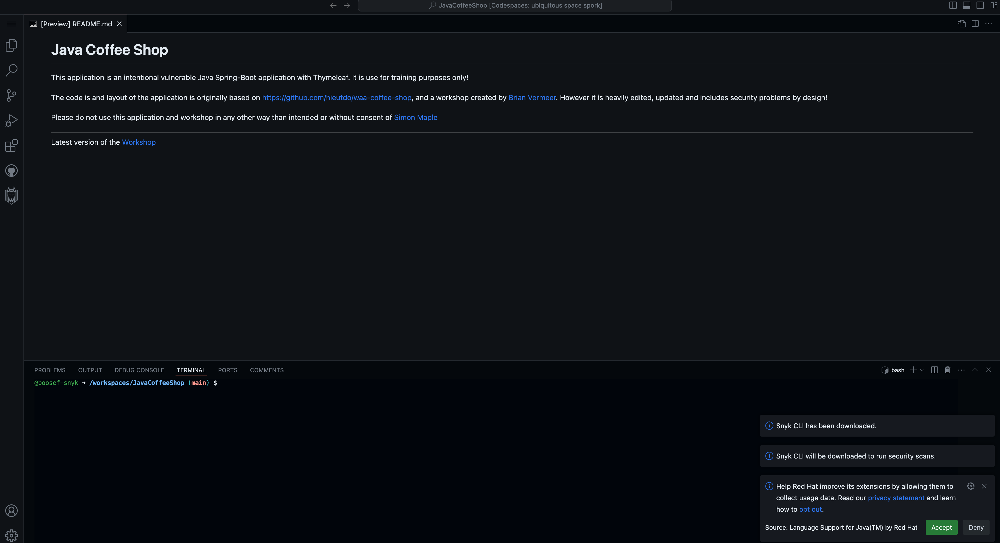

* While waiting, switch to your Snyk dashboard, first click on your name in the bottom left of the sidebar, and then '**Account Settings**'
* Under '**General Settings**' you should see a field under '**API Token**' - create your API key and copy it

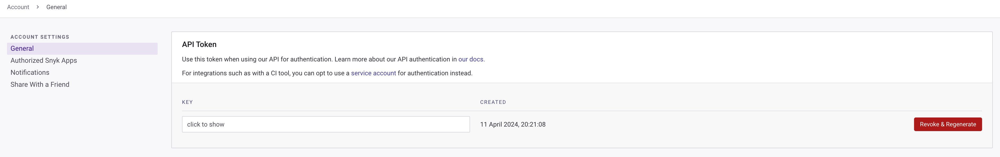

* If your Codespace is now ready, open the Command Palette (same as in VS Code - Cmd + Shift + P on Mac) and type `Snyk`
* Click on "**Snyk: Set Token**" and paste the copied API key when prompted

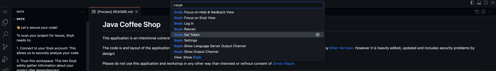

* You'll see the Snyk extension expand on the left if authentication is successful

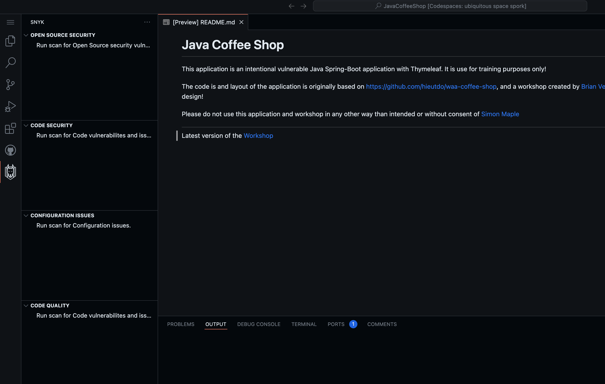

* Click the "**Rescan**" button in the Snyk extension panel to start them - moving forward, scans will run automatically whenever you save changes. If you see the extension panel refresh and populate with results like in the image below, congratultions, you have set Snyk up in the IDE successfully!

* Under "**Open Source Security**," expand the results for your pom.xml and click on X
* You should see the following:
  * An editor window opens up the pom.xml with the yellow lightbulb icon next to the line where the vulnerability appears
  * A new tab with details of the vulnerability appears to the right of your editor
* Click on the yellow lightbulb icon, and a list of options appears
* Select the first option under "**Quick Fix**" - "xyz"
* Save your changes, and the scans should start running again automatically
* When the Open Source scan completes, you should see that there are now only X vulnerabilities, where there previously were Y - congratulations, you have found and fixed vulnerabilities right from your IDE!    

 

<h1 align="center">Congratulations - Workshop Completed!!!</h1>

Thanks for attending and completing the live portion of this workshop. :) 

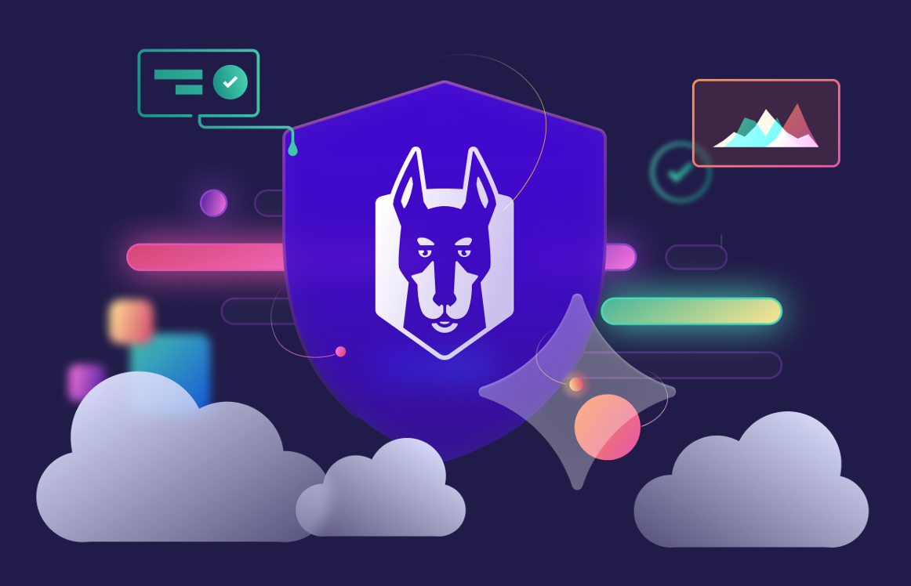

## Offline Tasks

Now that you have an idea of how Snyk works, and you have the basic setup completed, you can continue learning about Snyk on your own by trying out the following:

  
Setting up the Snyk CLI

  
Including Snyk scans in your pipelines using GitHub Actions

  
Integrating 3rd party tools with GitHub Actions to detect secrets

  

    
GitLeaks

  

  

    
TruffleHog

  

## Resources

-

Shilpa Raghunathan [shilpa.raghunathan at snyk.io] is a Staff Partner Solutions Engineer at Snyk  
Pas Apicella [pas at snyk.io] is a Principal Solution Engineer APJ at Snyk
